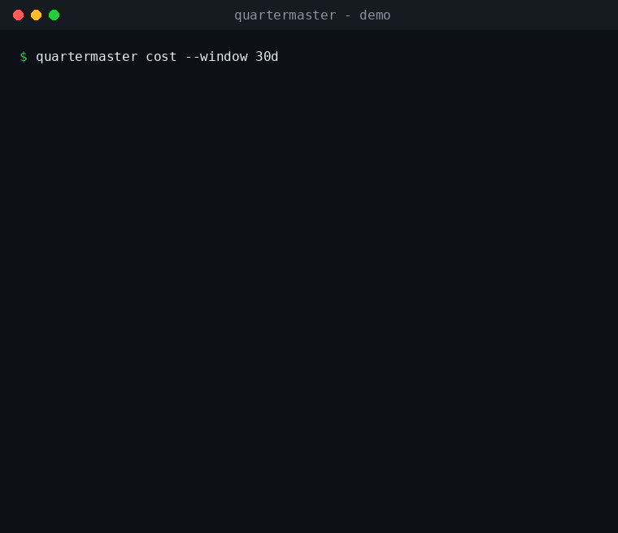

# Quartermaster

**The operations assistant for your AI agent fleet.**

Know what every agent is, what it's doing, what it costs, and what breaks if it
stops — from evidence, **advisory-only**, without asking whoever built it.

> Observe automatically. Decide manually. Understanding is the goal.

**A deterministic overseer for non-deterministic agents.** No LLM in the loop —
nothing to hallucinate, nothing to prompt-inject, nothing to bill. Quartermaster
watches your AI fleet precisely *because* it isn't one of them.
→ [Why the overseer isn't an AI](docs/WHY_DETERMINISTIC.md)



_(demo data — output is generated from evidence on your own box.)_

You're running a fleet of agents and automations on a box: a research worker, a
summarizer, an ingest bot, a couple of cron jobs, a database, an LLM agent quietly
burning money — and no map of any of it. Quartermaster is a read-only assistant you
point at that box. Like a unit's quartermaster, it tracks everything the fleet has,
what each piece is for, what it's spending, and what's running low — and **advises
you; it never commands the agents.** It changes nothing: no deploys, no restarts, no
auto-remediation.

> Works for any Linux service, not just AI agents — but it's built for the person
> trying to keep an agent factory legible.

## What it answers, for every agent/worker on the box

- **WHAT** it is and what it does
- **WHY** it exists
- **WHO / what** depends on it
- **WHERE** it lives — repo, service, ports, databases, dependencies
- **WHEN** it's active / last changed
- **WHAT IF** it stops, loses a dependency, or drifts
- **COST** — LLM/API spend, attributed to the agent that actually spent it

Every answer carries a **confidence level** (High / Medium / Low) and the
**evidence** behind it. "Unknown" is a valid answer — it never guesses.

## What it does

- **Discovers** repos, processes, services, containers, and ports (read-only).
- **Maps** the dependency/topology graph and tracks how it **drifts** over time.
- **Cost intelligence (the headline for agent fleets):** total spend per provider,
  attribution by evidence (a per-key 1:1 mapping, or an agent's own logged usage),
  runaway / budget alerts, and an **investigation for every dollar it can't
  attribute** — which key spent it, when it clustered, which process was calling
  that provider then, narrowed to candidates with confidence (never a fabricated
  owner).
- **Explains incidents** (OOM, restarts, exposed ports, runaway cost) as reports
  that say what's affected and **what to check next**.
- **Surfaces only what matters** — a money-critical pages immediately; impact-free
  churn stays in the daily digest. Optional Telegram delivery.

## Safety

Read-only. Writes only its own `data/` and `reports/`. No autonomous actions, ever.
Network is opt-in (Telegram, optional LLM features). Secrets are read from env only —
never logged, returned, or committed. No root required. See [SECURITY.md](SECURITY.md).

## Quickstart

```bash
pip install -e ".[dev]"
cp .env.example .env                       # edit locally; never commit it
QM_SCAN_TARGETS=/path/to/agents python scripts/scheduled_scan.py

qm cost --window 30d                       # spend per provider, attribution & budget
# or serve the read-only API:  uvicorn backend.main:app --port 8000  then:  qm health
```

Full guide: [docs/INSTALLATION.md](docs/INSTALLATION.md) · concepts:
[docs/OVERVIEW.md](docs/OVERVIEW.md) · questions: [docs/FAQ.md](docs/FAQ.md) ·
sample output: [docs/EXAMPLE_REPORT.md](docs/EXAMPLE_REPORT.md).

## How it thinks

Deterministic (same input → same output), evidence-first, confidence on every claim,
advisory-only. It's the manager's aide, not a controller of the agents.

## Status

Beta · Linux-first · MIT licensed. Contributions welcome — see
[CONTRIBUTING.md](CONTRIBUTING.md).
